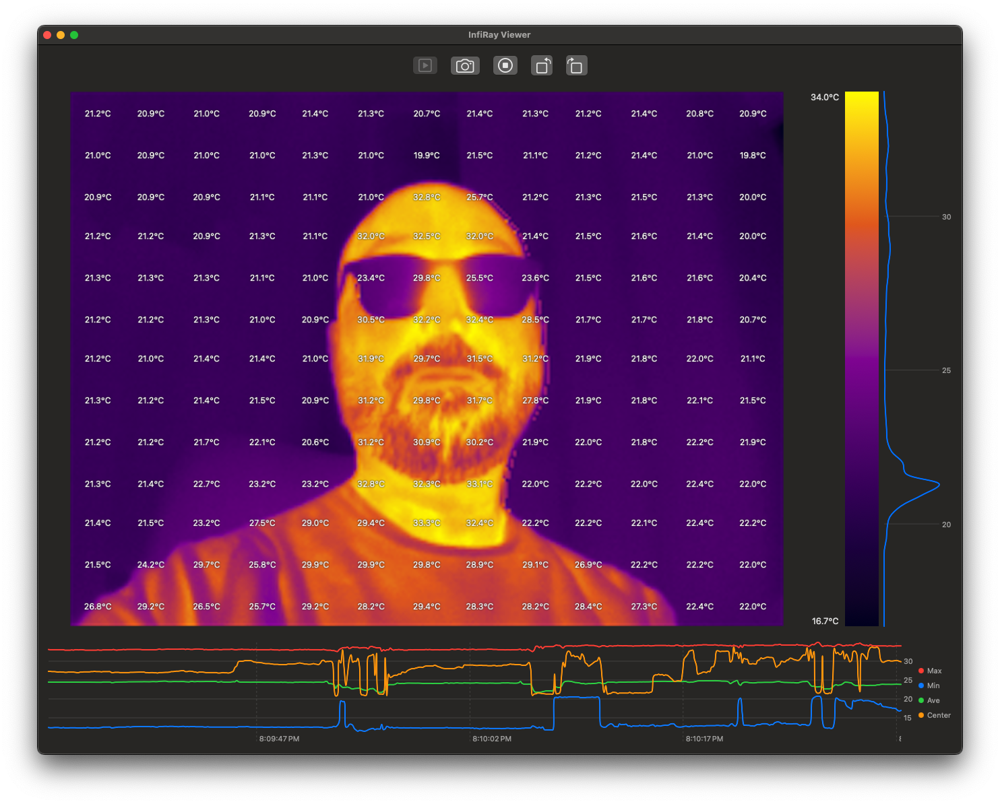

# IrProCapture

A macOS application for viewing and capturing thermal imagery from the InfiRay P2Pro USB thermal camera.

If you find this project useful, please consider [buying me a coffee](https://ko-fi.com/atomic14) or become a supporter on [Patreon](https://www.patreon.com/atomic14).

Alternatively, you can stop by my [YouTube channel](https://www.youtube.com/@atomic14) and watch a few videos.

This was mainly to scratch my own itch. There is an official Windows application, and there are various Python applications - but I could not get these to work on the Mac.

This application seems to work pretty well. It takes advantage of the fact that the InfiRay P2Pro acts as a USB Camera when plugged in. The actual image is pretty weird. The top half seems to be some kind of grey scale image and the bottom half is the temperature data.

I found a lot of useful information (in particular how to extract the temperature data) [here](https://github.com/LeoDJ/P2Pro-Viewer).

## Features

- Real-time thermal camera feed display
- Multiple color map options for thermal visualization
- Temperature histogram display
- Image capture functionality
- Video recording capability
- Adjustable camera orientation
- Temperature range display (min/max)

## Requirements

- macOS
- InfiRay P2Pro USB thermal camera
- Xcode

## Installation

1. Clone the repository
2. Open `IrProCapture.xcodeproj` in Xcode
3. Build and run the project

## Usage

1. Connect your InfiRay P2Pro thermal camera to your Mac
2. Launch IrProCapture
3. Click "Start Camera" to begin viewing the thermal feed
4. Use the menu bar options to:
   - Change color maps for different thermal visualizations
   - Adjust camera orientation
   - Capture still images
   - Record video

## License

This project is licensed under the MIT License. See the LICENSE file for details.